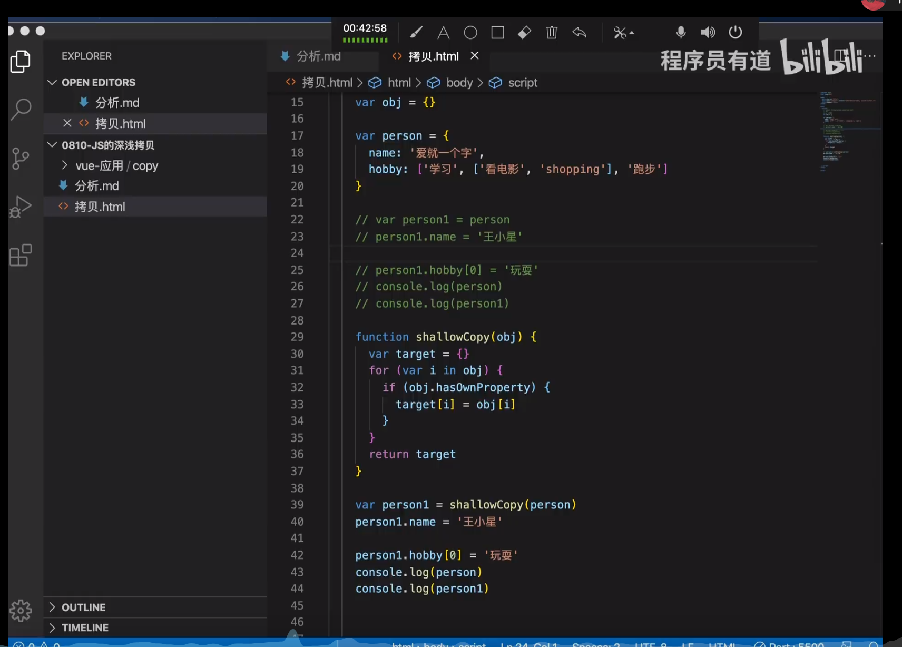
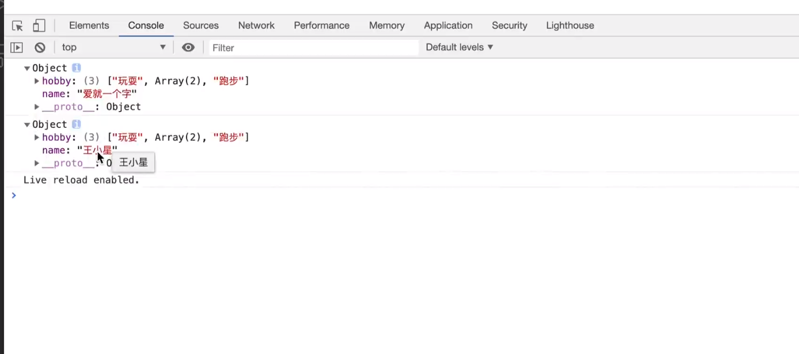
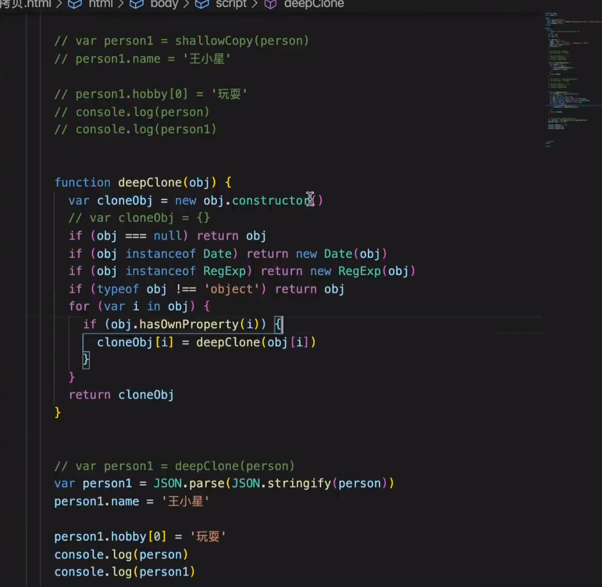

#### 预编译
1. 创建AO对象
2. 找形参和变量的声明,作为ao对象的属性名，值为undefined
3. 实参和形参相统一
4. 找函数声明，会覆盖变量的声明
AO:{

}

#### 箭头函数的this
箭头函数中的this时在定义函数的时候绑定，而不是在执行函数的时候绑定。

箭头函数中，this指向的固定化，并不是因为箭头函数内部有绑定this机制，实际原因是因为*箭头函数根本没有自己的this*，导致内部的this就是外层代码块的this。正是因为他没有this所以不能用作构造函数。

### 深浅拷贝

#### 类型
1. 基本类型 null、number、boolean、undefined、string  **堆中**
2. 引用类型obj **栈中**

var obj = {}
obj存在栈中，{}存在堆中.
#### 浅拷贝、深拷贝
1. 浅拷贝：是创建一个新对象，这个对象有着原始对象属性值的一份精确拷贝。**如果属性是基本类型,拷贝的就是基本类型的值，互不影响**。**如果属性是引用类型，拷贝的就是内存的地址**，所以如果其中一个对象改变了这个地址，就会影响到另一个对象。


引用类型的值改变了，基本类型没变。


2. 深拷贝：是将一个对象从内存中完整的拷贝一份出来，从堆内存中开辟一个新的区域用于存放新对象，且修改新对象不会影响到原对象。
    * Object.assign()是深拷贝

    那么深拷贝可能就需要层层递归，复制对象的所有属性，包括对象属性的属性的属性，有人想出了用JSON的解析实现
    ``` javascript
    function deepCopy(obj){
        if(typeof obj !== "object"){ return ;}
        var str = JSON.stringify(obj);
        return JSON.parse(str);
    }
    ```
    上面的方法不适用的条件是
    * 需要考虑把函数，正则等特殊数据类型复制
    * 当前对象不支持JSON
    * JSON复制会忽略掉值为undefined以及函数表达式
    ```javascript
    var obj = {
        a: 1,
        b: 2,
        c: undefined,
        sum: function() { return a + b; }
    };
    var obj2 = JSON.parse(JSON.stringify(obj));
    console.log(obj2);//输出：Object {a: 1, b: 2}
    ```
    完整的深拷贝如下
    
3. 赋值

    *以下例子为赋值：*
    var per = {name:'小李'}
    var per1 = per
    per1.name='张'

    console.log(per)
    console.log(per1)
    对象的赋值就是简单的引用,a = [1,2,3], b=a, 在上述情况下,a和b是一样的,他们指向同一片内存,b不过是a的别名,是引用
    赋值操作(包括对象作为参数、返回值),不会开辟新的内存空间,他只是赋值了对象的引用.也就是除了b这个名字之外,没有其他的内存开销,修改了a也就影响了b,修改了b,也就影响了a.

#### instanceof 
A instanceof B

B的 prototype 在左边变量A的原型链上即可

#### 防抖
当持续触发事件，一定事件内没有再触发事件 事件处理函数才会执行一次 如果设定的时间到来之前 又一次触发了事件  就重新开始延时
```html
   <input type="text" id="input">
    <script>
        var input = document.getElementById('input')
        let timer
        function debounce(delay,value){
            clearInterval(timer)
            timer = setTimeout(function(){
                console.log(value)
            },delay)
        }
        input.addEventListener('keyup',function(e){
            debounce(1000,e.target.value)
        })
    </script>
```
常见的浏览器宽度的改变，输入框。
#### 节流函数
当触发事件的时候，保证一段时间 只调用一次事件处理函数。

一段时间只做一件事情。

案例：典型的案例就是鼠标不断点击触发，规定再n秒内多次点击只有一次生效。
```javascript
    <button id='btn'>点击</button>
    <script>
        var btn = document.getElementById('btn');

        function thro(delay){
            let timer
            return function(){
                if(!timer){
                    timer = setTimeout(function(){
                        console.log('执行了点击')
                        timer = null;
                    },delay)
                }
            }
        }
        
        btn.onclick = thro(2000)
    </script>
```
#### 闭包
```javascript
function a(){
    var a = 123
    function b(){
        var b = 234
        console.log(a)
    }
    return b
}
var res = a()
res()
```

#### 哪些操作会造成内存泄漏
* 闭包
* 意外的全局变量
* 被遗忘的定时器
* 脱离dom的引用

#### 高阶函数

将函数作为参数或者返回值的函数

#### 手写`Array.prototype.map`的方法

```javascript
    var arr = [1,2,3]
    // var array = arr.map((item,index) =>{
    //     return item * 2
    // })
    // console.log(array)
    function map(arr,mapCallback) {
        if (!Array.isArray(arr) || !arr.length || typeof mapCallback !== 'function'){
            return []
        }else{
            let result = []
            for (let i = 0; i < arr.length; i++) {
                // const element = arr[i];
                result.push(mapCallback(arr[i],i,arr))
            }
            return result
        }
    }
    var res = map(arr,(item) => {
        return item * 2
    })
    console.log(res)
```

#### js时间循环机制 event-loop

* 调用栈
* 微任务队列
* 消息队列

js异步操作 比如fetch、setTimeout、setInterval 压入到调用栈中的时候里面的消息会进入到消息队列中去 。 消息队列中 会等到调用栈清空之后在执行

promise async await的异步操作的时候会加入到微任务中去  会在调用栈清空的时候立即执行。调用栈中加入的微任务会比消息队列先执行


#### 单例模式的理解
定义：1、只有一个实例   2、可以全局的访问
需求： 弹窗 
