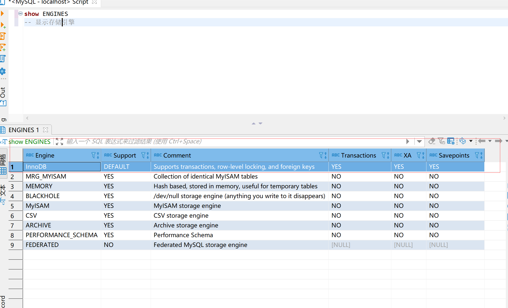

# mysql 学习篇

### mysql有哪几种数据库存储引擎
show engines 显示存储引擎
 
* InnoDB
每个表只有一个文件，idb
* MyISAM
每个表有两个文件：MYD 数据文件 ，MYI是索引文件。
#### 区别
XA start 'test' 开启事务


回滚p1
```
insert into xxx VALUES(1)
insert into xxx VALUES(2)
Savepoints p1
insert into xxx VALUES(3)
insert into xxx VALUES(4)
rollback p1
```