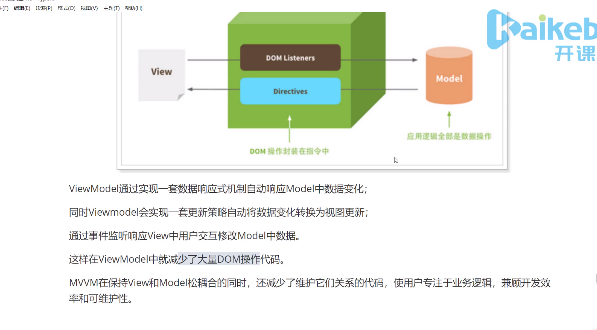
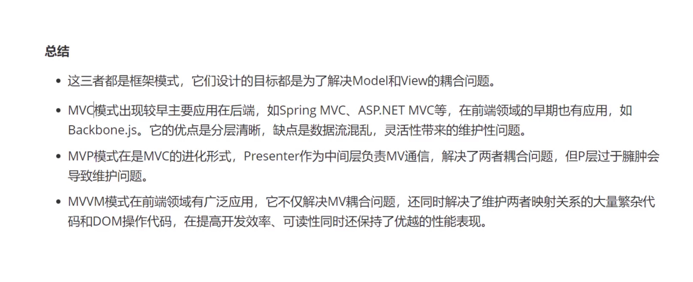
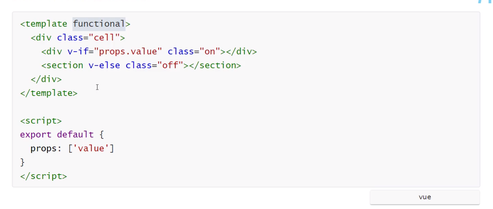
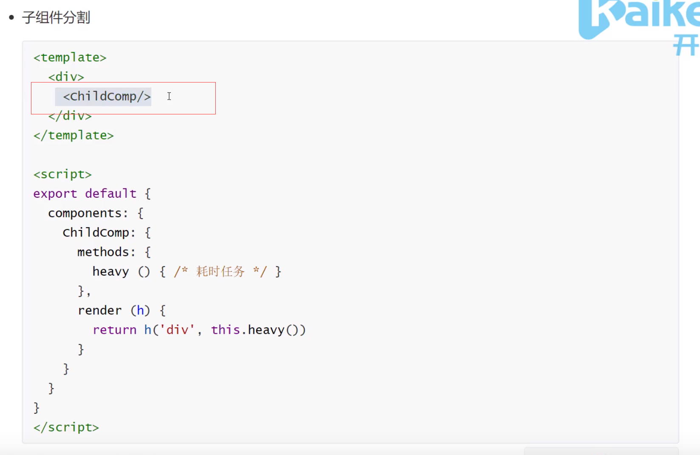
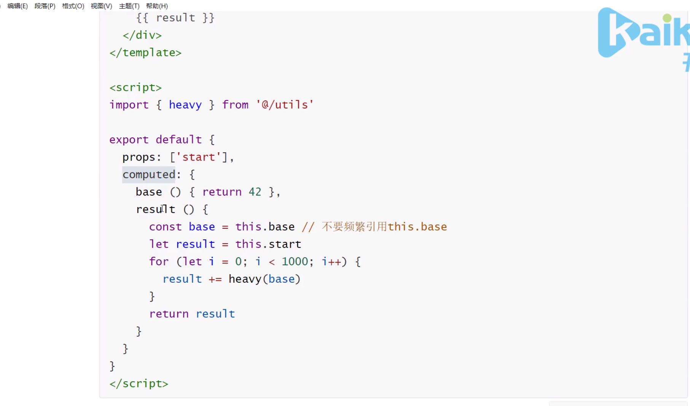

#### vue组件data要函数形式？
vue组件可能存在多个实例，如果使用对象形式定义data，则会导致他们共用一个data对象，那么状态变更将会影响所有组件实例，这是不合理的；采用函数形式定义，在initData时会将其作为一个工厂函数返回全新data对象，有效规避多实例之间状态污染问题。而在vue跟实例创建过程中则不存在该限制，而是根实例只能有一个，不需要担心这种情况。
#### key的作用和原理。
1. key的作用主要是为了高效的更新虚拟Dom，其原理是vue在patch过程中通过key可以精准的判断两个节点是否是同一个，从而避免频繁的更新不同元素，使得整个patch过程更加高效，减少DOM操作量，提高性能。
2. 另外，若不设置key还可能在列表更新时引发一些屏蔽的bug。
3. vue中在使用相同标签名元的过渡切换时，也会使用到key属性，其目的也是为了让vue可以区分他们，否则vue只会在替换内部属性而不会触发过渡效果。
#### 怎么看vue中diff算法
1. diff算法是虚拟DOM技术的必然产物，通过新旧虚拟Dom做对比(即diff)，将变化的地方更新在真实Dom上，另外，也需要diff高效的执行对比过程，从而降低时间复杂度为O(n)
2. vue2.x中为了降低Watcher粒度，每个组件只有一个Watcher与之对应，只有引入diff才能精确找到发生变化的地方。
3. vue中diff执行的时刻是组件实例执行其更新函数时，他会对比上一次渲染结果oldVnode和新的渲染结果newVnode，此过程称为patch。
4. diff过程遵循深度优先、同层比较的策略；两个节点之间比较会根据他们是否时子节点或者文本节点做不同的操作。
#### 对vue组件化的理解？
1. 组件是独立和可复用的代码组织单元。组件系统是vue核心特性之一，它使开发者使用小型、独立和通常可复用的组件构建大型应用。
2. 组件化开发能大幅提高应用开发效率、测试性、复用性等
3. 组件使用按分类有：页面组件、业务组件、通用组件
4. vue的组件是基于配置的，我们通常写的组件是组件配置而非组件，框架后续会生成其构造函数，它们基于vueComponent，扩展Vue
5. vue常见的组件化技术有：prop，自定义事件，插槽等，他们主要是用于组件通信、扩展等
6. 遵循单向数据流的原则
#### 对vue设计原则的理解？
1. 易用

已经会了 HTML、CSS、JavaScript？即刻阅读指南开始构建应用！

2. 灵活

不断繁荣的生态系统，可以在一个库和一套完整框架之间自如伸缩。

3. 高效

20kB min+gzip 运行大小、超快虚拟 DOM、最省心的优化
#### MVC、MVVM、

#### vue中组件之间的通信
1. 父子组件通信 props
2. 兄弟组件通信 vuex
3. 跨层组件通信 provide inject
#### vue性能优化方法？
1. 路由懒加载
2. keep-alive （缓存页面）
3. 使用v-show复用Dom
4. v-for 遍历避免同时使用v-if。用计算属性
5. 如果是大数据长列表，可采用虚拟滚动，只渲染少部分区域的内容（vue-virtual-scroller）
6. 事件的销毁：vue组件销毁时，会自动解绑它的全部指令及事件监听器，但是仅限于组件本身的事件。（虽然会自己销毁）
7. 图片懒加载：可视区域优先加载。
8. 第三方插件按需引入
9. 无状态的组件标记为函数式组件(没有引入vue)

10. 子组件分割

11. 变量的本地化(图中的base)

12. ssr

#### vue3 新特性
1. 更快
    * 虚拟DOM重写
    * 优化slots的生成
    * 静态树的提升
    * 基于Proxy的响应式
2. 更小：通过摇树优化核心库体积
3. 更容易维护： ts+模块化
4. 更加友好
    * 跨平台：编译器核心和运行时核心与平台无关，使得Vue更容易与任何平台（ios等）一起使用
5. 更容易使用
    * 改进ts的支持
    * 更好的调试支持
    * 独立响应式模块
    * Composition API

#### watch和computed的区别及使用
watch 需要在数据变化时执行异步或开销较大的操作时，简单讲，当一条数据影响多条数据，例如搜索数据。监听
computed 对于任何复杂逻辑或一个数据属性在它所依赖的属性发生变化时，也要发生变化时。计算属性
#### 对vue生命周期的理解
